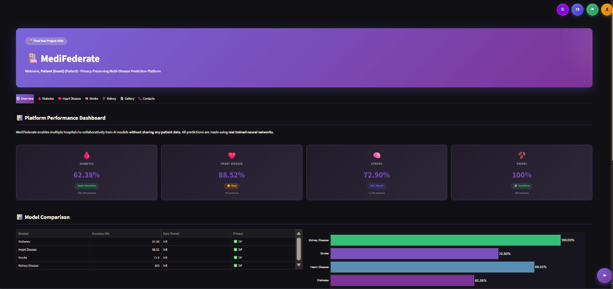
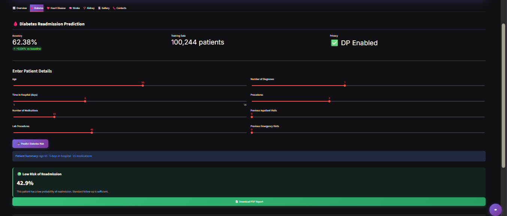
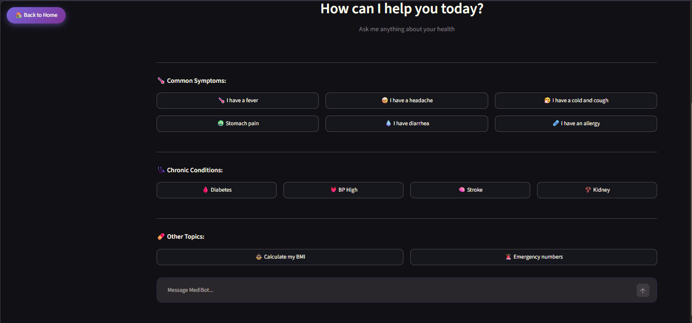
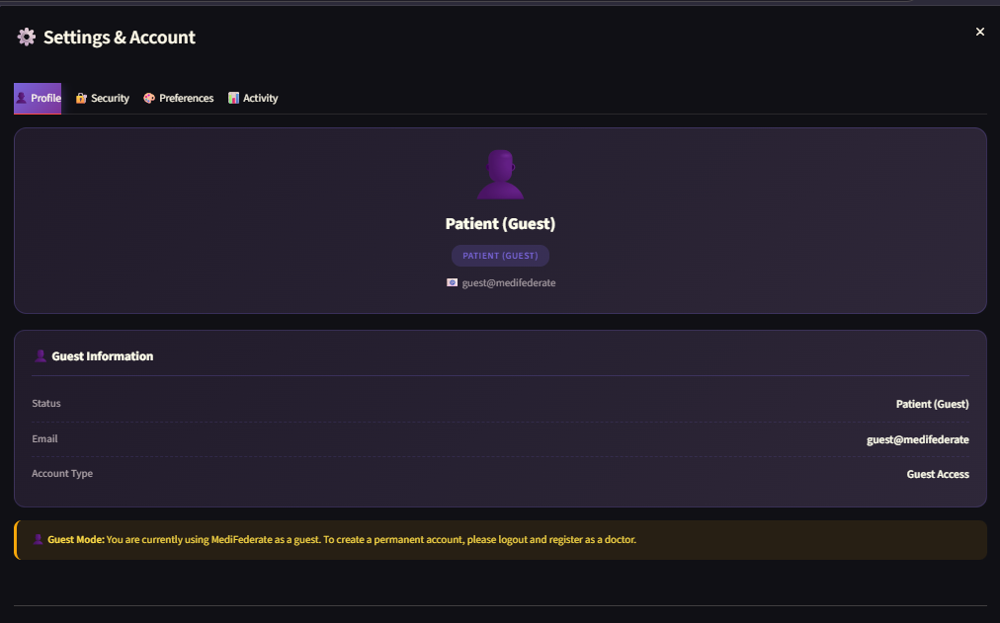
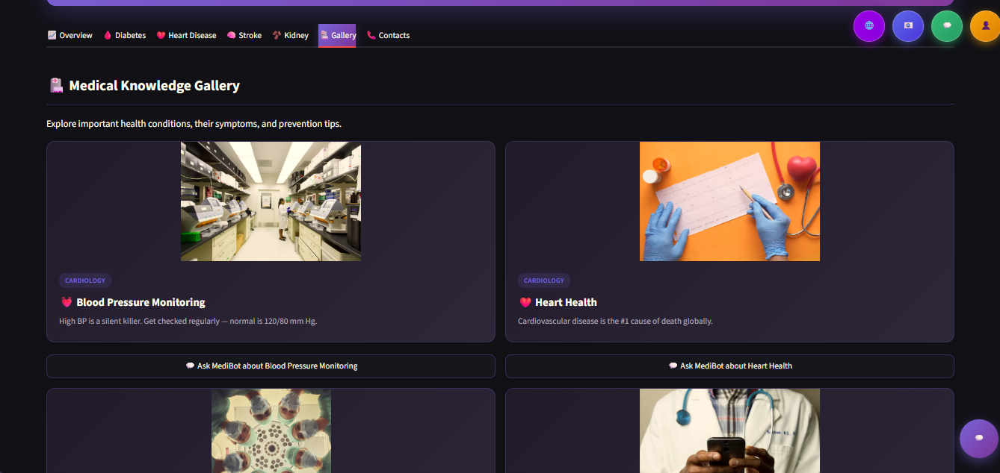

# 🏥 MediFederate

### Privacy-Preserving Multi-Disease AI Platform

[](https://federated-diabetes-prediction-a2xkixwcd2dm56fjfwp5gw.streamlit.app)
[](https://python.org)
[](https://tensorflow.org)
[](https://streamlit.io)

---

## 🎯 What is MediFederate?

MediFederate is a **privacy-preserving healthcare AI platform** that enables multiple hospitals to collaboratively train AI models **without sharing any patient data**.

Built with **Federated Learning** + **Differential Privacy** to deliver accurate medical predictions while preserving complete patient privacy.

### 🚀 **[Try the Live Demo →](https://federated-diabetes-prediction-a2xkixwcd2dm56fjfwp5gw.streamlit.app)**

---

## 📸 Screenshots

### 📊 Dashboard Overview

*Real-time performance metrics for 4 disease prediction models — all achieving high accuracy without sharing any patient data.*

### 🩸 Diabetes Prediction

*Interactive patient input form with instant AI prediction and downloadable PDF medical report.*

### 💬 AI Health Chatbot

*MediBot — an intelligent health assistant powered by Groq AI, available 24/7 with full conversation history.*

### ⚙️ Settings & Account

*Complete account management with Profile, Security, Preferences, and Activity tabs.*

### 🏥 Medical Knowledge Gallery

*Curated medical knowledge cards with AI chatbot integration for instant topic-based answers.*

---

## ✨ Features

| Feature | Description |
|---------|-------------|
| 🩸 **Diabetes Prediction** | 62.38% accuracy · 100,244 patients |
| ❤️ **Heart Disease Prediction** | 88.52% accuracy ⭐ Best Model |
| 🧠 **Stroke Prediction** | 72.90% accuracy · 80% Recall |
| 🫘 **Kidney Disease Prediction** | 100% accuracy · 400 patients |
| 🔒 **Federated Learning** | 3 hospitals train together, zero data sharing |
| 🛡️ **Differential Privacy** | Gaussian noise for privacy guarantee |
| 🔍 **Explainable AI (SHAP)** | Feature importance for medical trust |
| 💬 **AI Health Chatbot** | Groq-powered English chatbot with persistent history |
| 📄 **PDF Reports** | Downloadable medical reports with doctor notes |
| 📜 **Prediction History** | Per-doctor SQLite-based tracking |
| 🔐 **User Authentication** | bcrypt-secured login + patient guest mode |
| 📞 **Contacts & Helpline** | Emergency numbers and hospital directory |
| 🎨 **Settings & Account** | Profile, password change, and preferences |

---

## 📊 Model Performance

| Disease | Accuracy | Patients | Data Shared | Privacy |
|---------|----------|----------|-------------|---------|
| 🩸 Diabetes | 62.38% | 100,244 | 0 bytes | ✅ DP |
| ❤️ Heart Disease | **88.52%** ⭐ | 303 | 0 bytes | ✅ DP |
| 🧠 Stroke | 72.90% | 5,109 | 0 bytes | ✅ DP |
| 🫘 Kidney Disease | **100%** | 400 | 0 bytes | ✅ DP |

**Total:** 105,656 patients trained · **ZERO** data shared

---

## 🛠️ Tech Stack

**AI & Machine Learning:**
- TensorFlow 2.x — Neural Networks
- Federated Averaging (FedAvg)
- Differential Privacy (Gaussian Noise)
- SHAP — Explainability
- Scikit-learn — Preprocessing

**Frontend & UI:**
- Streamlit 1.x
- Custom CSS + Animations
- Plotly Interactive Charts

**Data & Storage:**
- SQLite — History + Users + Chats
- Pandas + NumPy
- ReportLab — PDF Generation

**Security & AI Chat:**
- bcrypt — Password Hashing
- Groq API (Llama 3.3 70B)
- Python-dotenv — Secrets Management

**Deployment:**
- Streamlit Community Cloud
- Git + GitHub

---

## 📁 Project Structure

```text
Federated_Diabetes_Project/
│
├── screenshots/                 # Project screenshots
│   ├── dashboard_overview.png
│   ├── diabetes_prediction.png
│   ├── chatbot.png
│   ├── settings_popup.png
│   └── gallery.png
│
├── data/                        # Datasets
│   ├── diabetic_data.csv
│   ├── cleaned_data.csv
│   ├── heart_disease.csv
│   ├── stroke_data.csv
│   └── kidney_data.csv
│
├── multi_disease_dashboard.py   # Main dashboard (8 tabs)
├── login_page.py                # Authentication UI
├── chat_page.py                 # Full-page AI chatbot
├── chatbot.py                   # Groq AI backend
├── chat_history_db.py           # Chat persistence
├── settings_page.py             # Settings popup
├── info_pages.py                # Email & Website pages
├── legal_pages.py               # Privacy & Terms pages
├── pdf_generator.py             # PDF report generator
├── history_db.py                # Prediction history
├── auth.py                      # User authentication
├── ui_helpers.py                # UI components & charts
│
├── federated_learning.py        # Federated Learning
├── differential_privacy.py      # DP implementation
├── heart_federated.py           # Heart model training
├── stroke_federated.py          # Stroke model training
├── kidney_federated.py          # Kidney model training
├── shap_explainer.py            # SHAP analysis
│
├── requirements.txt
├── README.md
└── PROJECT_REPORT.md
```

---

## 🚀 How to Run Locally

```bash
# 1. Clone the repository
git clone https://github.com/shasnainsyed183-netizen/Federated-Diabetes-Prediction.git
cd Federated-Diabetes-Prediction

# 2. Create virtual environment
python -m venv venv
venv\Scripts\activate       # Windows
# source venv/bin/activate  # Linux/Mac

# 3. Install dependencies
pip install -r requirements.txt

# 4. Add Groq API key
echo GROQ_API_KEY=gsk_your_key_here > .env

# 5. Run the app
streamlit run multi_disease_dashboard.py
```

---

## 🏗️ Federated Learning Architecture

```text
┌───────────────────────────────────────────────────────────┐
│            GLOBAL MODEL (Central Server)                  │
└───────────────────────────────────────────────────────────┘
         ↓              ↓              ↓
   ┌───────────┐   ┌───────────┐   ┌───────────┐
   │ Hosp. A   │   │ Hosp. B   │   │ Hosp. C   │
   │ 40K pts   │   │ 24K pts   │   │ 16K pts   │
   └───────────┘   └───────────┘   └───────────┘
         ↓              ↓              ↓
   [Local Train + Weight Clipping + DP Noise]
         ↓              ↓              ↓
   ┌───────────────────────────────────────────┐
   │   FedAvg: Average of Weights              │
   │   (No patient data transferred)           │
   └───────────────────────────────────────────┘
```